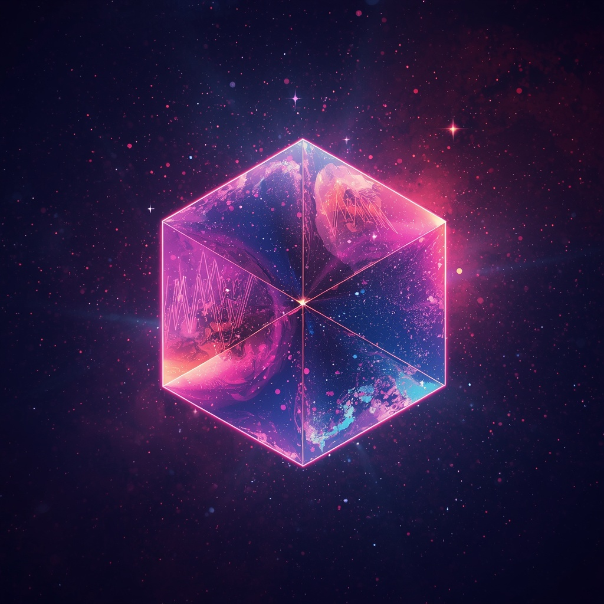
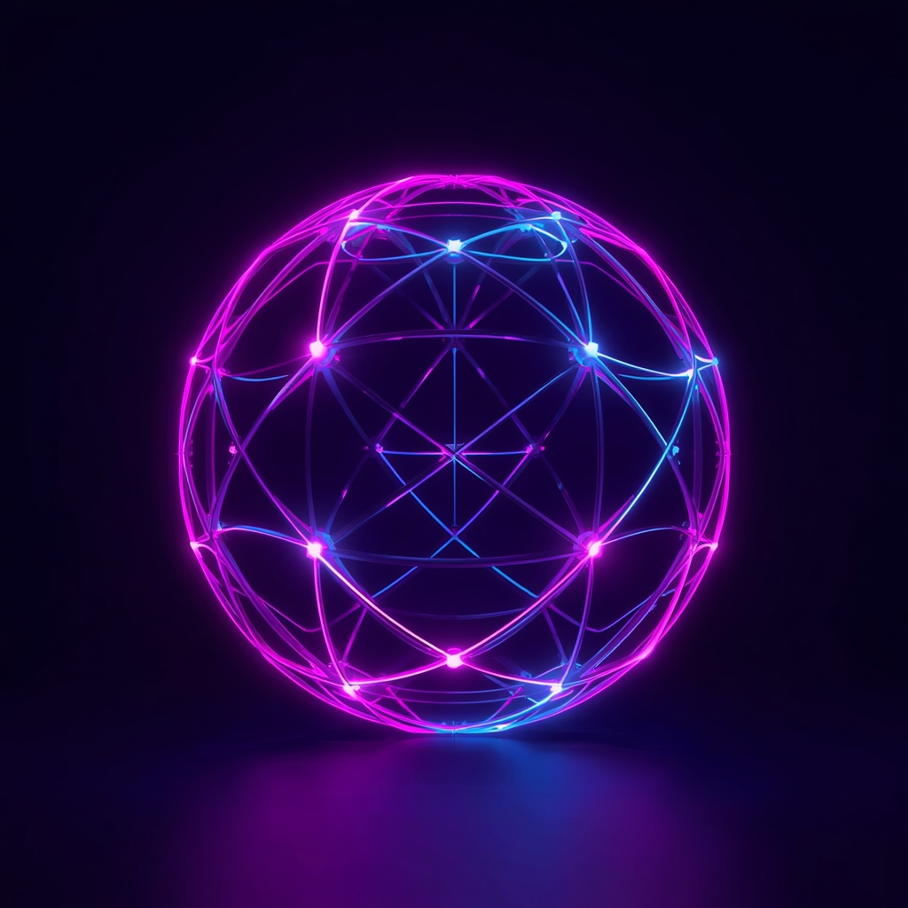
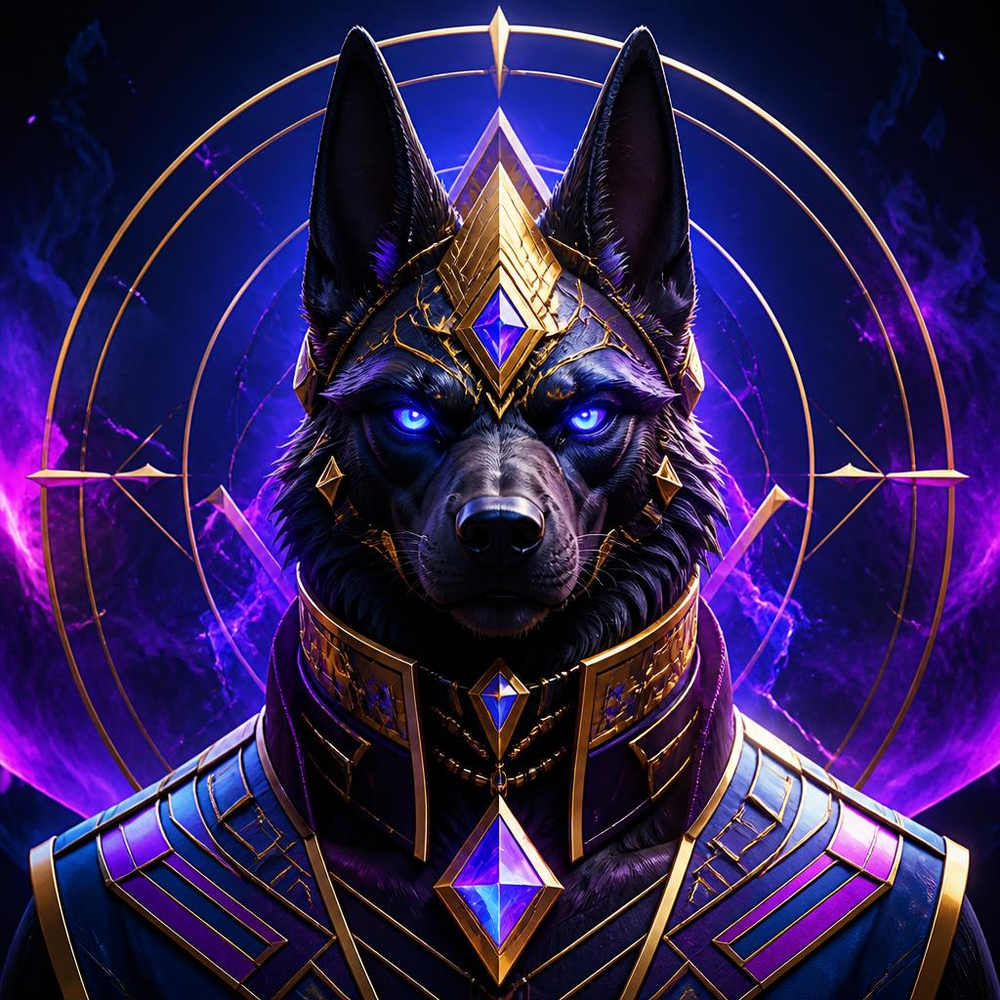
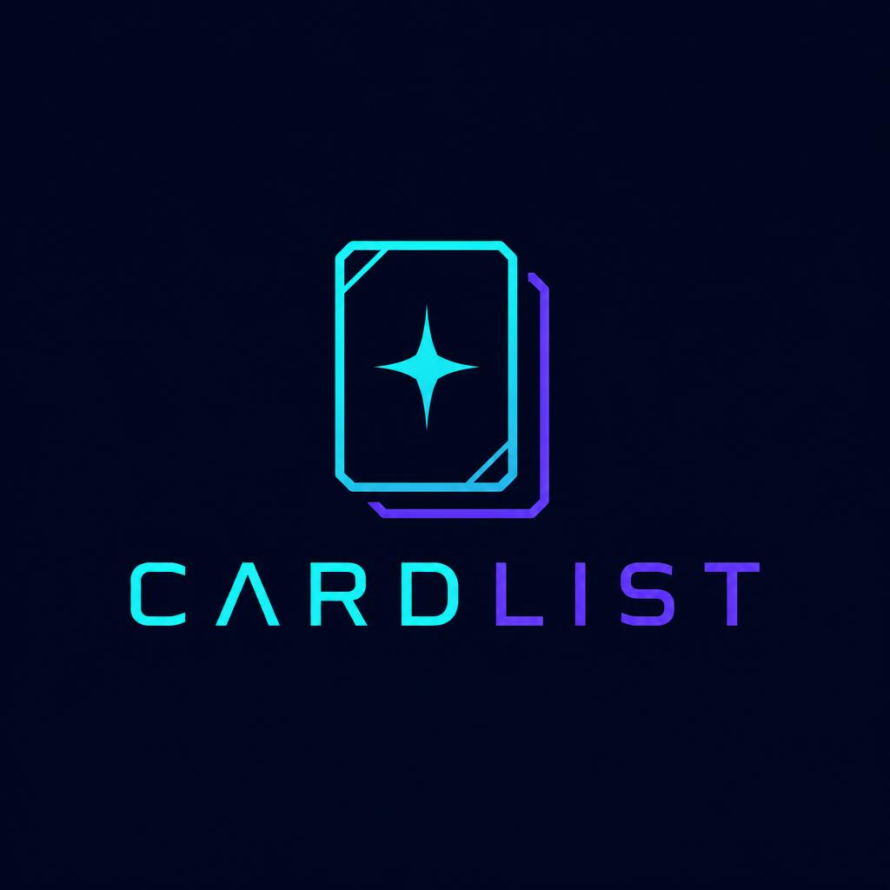

# CardList - NFT Collection

Um portfólio de NFTs para a observação da arte digital, no card tendo a própria NFT, nome da NFT, descrição e o seu preço.

# Como acessar

- [Abrir a página](./index.html) no navegador.
- Para servir o projeto localmente, execute python -m http.server 8000 na pasta do projeto e acesse [http://localhost:8000](http://localhost:8000).
- Não há uma versão publicada online configurada neste projeto.

- # O quê usamos?

- HTML para a estruturar o portfólio;
- CSS para a estilização da estrutura do HTML;
- SVG, JPG e PNG para imagens.

- ## Imagens

As imagens das obras abaixo são recursos já presentes no projeto:

Obs: Todas as imagens foram pegadas de uma inteligência artificial.

## Inspiração

Referências consultadas para organização e navegação de galerias e marketplaces:

- [OpenSea](https://opensea.io/)
- [Rarible](https://rarible.com/)

As referências serviram apenas como inspiração, o layout foi todo feito neste projeto.

## Logo

A logo original do Cardlist foi criada no Leonardo.ai, com fundo azul-marinho e um símbolo de card colecionável com estrela em ciano e violeta.
O símbolo foi recortado da composição para se ajustar ao cabeçalho.
A imagem completa também está disponível abaixo.

- [Logo completa em JPEG](./assets/cardlist-logo.jpg)
- [Símbolo usado no cabeçalho em PNG](./assets/cardlist-logo-mark.png)

# Autores
ZePingusso - Lucas Bispo da Cruz - lucas.cruz4@estudante.ifms.edu.br
lucasgomesnascimento416333-glitch - Lucas Gomes do Nascimento - lucas.nascimento8@estudante.ifms.edu.br
enriquecharao-ctrl - Enrique Meira Charão - enrique.charao@estudante.ifms.edu.br
Professor Fábio Duarte de Oliveira - fabio.oliveira@ifms.edu.br
